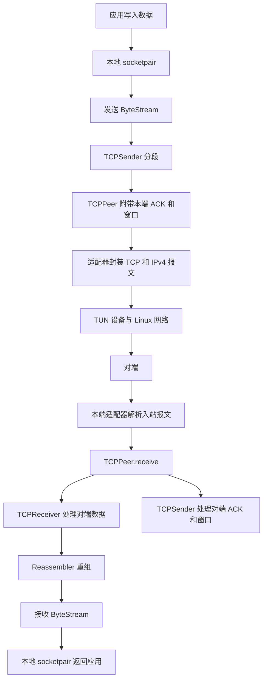

# 从当前代码理解 minnow

这份说明对应当前 `dev` 分支、提交 `4f0d1de`，以及目录中的 CS144 Fall 2025 指导 PDF。目的是先看清整体，再回到你已经实现的函数。这里的完成范围根据本地保存的 Git 提交记录、当前源码和本次测试确认，没有从 GitHub 拉取更新。

## 1. 简历应该怎么改

`resume.revised.txt` 是可选替换稿，原 `resume.txt` 保留。

你的原稿列出的 ByteStream、Reassembler、TCPReceiver、TCPSender 都有实现，主要问题是标题范围过大，以及描述偏向罗列模块职责。建议标题用“基于 CS144 的 TCP 核心模块实现”，正文写清你采用的数据结构、处理的边界情况和验证方法。

替换稿里的“无拷贝”仅修饰 `peek()` 返回视图这一操作。整个发送和重组流程仍有字符串复制，不能称为整个协议栈零拷贝。通过测试也不能推导出任意网络环境下都能保证送达。

| 阶段 | 指导中的任务 | 当前可确认的范围 |
| --- | --- | --- |
| 0 | 网络热身、webget、ByteStream | 有 webget 与 ByteStream 实现；ByteStream 本次测试通过，webget 网络测试未重跑 |
| 1 | Reassembler | 已实现，本次对应测试通过 |
| 2 | Wrap32、TCPReceiver | 已实现，本次对应测试通过 |
| 3 | TCPSender、使用自制 TCP 通信 | Sender 已实现，对应测试通过；webget 已改为 CS144TCPSocket，但真实联网实验不能仅凭代码判定完成 |
| 4 | 真实网络路径数据采集与统计 | 你说明未做；这份 PDF 明确不使用你实现的 TCP |
| 5 | NetworkInterface、ARP、以太网收发 | 合入了起始代码，但 send_datagram、recv_frame、tick 仍是空实现 |
| 6 | IP 路由器 | 未完成；src 中没有 router 实现 |
| 7 | 组网及创意项目 | 你说明未做，当前仓库不能支撑完成表述 |

提交记录中的可讲述细节：

- `4ba5ce0`：checkpoint 1 测试通过记录。
- `7f390a7`、`e4b78b0`：Wrap32 和 Receiver 实现。
- `a1c1acf`：ByteStream 优化，提交说明记录约 9 Gbit/s。
- `738d3d9`：string_view 生命周期错误修复。
- `66dca88`：Sender 实现。
- `7897460`：合并 checkpoint 5 起始代码，合并并不等于完成实验。

不必为了简历把后续全部补完，但需要能解释已写进去的机制。也不要把课程提供的 TCPPeer、事件循环、报文解析及校验和框架写成自己实现的成果。

## 2. 先分清目录和入口

| 目录 | 作用 | 建议关注点 |
| --- | --- | --- |
| src | 你主要实现的核心组件，也包含未完成的网卡骨架 | ByteStream → Reassembler → Receiver → Sender |
| util | 课程提供的连接框架、文件描述符、事件循环、报文封装等 | tcp_peer.hh、tcp_minnow_socket_impl.hh、tcp_over_ip.cc |
| apps | 可运行的应用程序 | webget、tcp_ipv4、tcp_native |
| tests | 课程测试程序及测试驱动 | reassembler_holes.cc、send_retx.cc、sender_test_harness.hh |
| etc | 构建和测试配置 | tests.cmake、cflags.cmake |
| build | 生成的库、程序、测试和日志 | apps/、tests/、Testing/Temporary/LastTest.log |

`minnow` 不是一个从单一 main 函数开始运行的程序。核心组件被编译为库，应用和测试程序分别链接这些库，各自有 main。

`apps/tcp_native.cc` 使用 Linux 内核的 TCPSocket。当前 `apps/webget.cc` 使用 CS144TCPSocket，会走你写的 Sender/Receiver；`apps/tcp_ipv4.cc` 也使用课程提供的自制 TCP Socket 框架。

## 3. 一份数据到底怎么走

每个 TCPPeer 同时有 Sender 和 Receiver，因为连接是双向的。它们分别处理两个方向，不能把它们理解成只有发送方机器才有 Sender。



这里有两个不同的 ByteStream：发送流保存应用尚待发送的数据，接收流保存重组完成但应用尚未消费的数据。Sender 将数据从发送流 pop 掉，只意味着已经放入报文；仍需保留报文副本，等待 ACK 或重传。

网络发送这一步由回调 `transmit` 接上。Sender 本身没有直接调用操作系统的网络 send。真实运行时回调连接适配器，单元测试时回调连接内存队列。

以当前 webget 为例：

1. `apps/webget.cc` 的 main 调用 get_URL，创建 CS144TCPSocket 并 connect。
2. Socket 初始化 TCPPeer，调用 push，初始窗口为 1，先发出占一个序列号的 SYN。
3. 适配器封装报文，经 tun144 交给 Linux；返回报文被解析后交给 TCPPeer。
4. TCPPeer 把对端的发送信息交给 Receiver，把对端的 ACK/窗口交给 Sender；必要时回复。
5. connect 完成后，应用 write HTTP 请求；数据通过本地 socketpair 进入 TCP 工作线程的发送 ByteStream，再由 Sender 分段发送。
6. 服务器返回数据，Receiver 转换序列号，Reassembler 拼成有序字节流，框架把字节写回 socketpair；应用 read 后输出到终端。
7. 流结束时处理 FIN，应用读到 EOF 后 wait_until_closed 等待收尾。

第一次阅读时先沿着函数调用看数据传递，不必立刻钻进所有 Socket、序列化和校验和实现。

## 4. 谁在调用你写的函数

在 `util/tcp_minnow_socket_impl.hh` 的 `_initialize_TCP()` 中，框架注册了三个事件：

| 事件 | 框架做什么 | 最终调用的模块 |
| --- | --- | --- |
| 网络报文可读 | 适配器解析报文，交给 TCPPeer.receive | Receiver.receive 和 Sender.receive |
| 应用写入数据 | 从 socketpair 读取数据，写入 outbound_writer，再调用 TCPPeer.push | ByteStream.Writer.push 和 Sender.push |
| 重组后的数据可读 | 从 inbound_reader 查看数据，写回应用，只 pop 实际写出的长度 | ByteStream.Reader.peek/pop |

`_tcp_loop()` 还会根据实际经过的毫秒数调用 TCPPeer.tick，再转给 Sender.tick。Sender 中的定时器不是独立睡眠线程，也不是自己查询时钟；有人调用 tick，它才推进计时。

`TCPReceiver::send()` 的名字也容易误解：它只是生成 ACK、窗口和 RST 信息，不负责把数据发到网线上。TCPPeer 把它和 SenderMessage 组合成 TCPMessage，再交给发送回调。

## 5. 用一个例子连接序列号、重组和 ACK

假设 A 的 ISN 是 1000，要向 B 发送 `abcdef`，B 容量足够，下面只观察 A→B 这个方向。B 自己的发送方向有另一个独立的 ISN。

| 到达 B 的内容 | TCP 序列号 | 流索引 | B 的重组结果 | B 生成的 ACK |
| --- | --- | --- | --- | --- |
| SYN | 1000 | 没有数据 | 建立序列号起点 | 1001 |
| def | 1004 | 3 | 缓存 def，前面缺 abc | 1001 |
| abc | 1001 | 0 | 连续输出 abcdef | 1007 |
| FIN | 1007 | 6，即结束位置 | 关闭输出流 | 1008 |

ACK 表示“下一个期待的序列号”。乱序收到 def 时不能把 ACK 直接跳到末尾，因为 abc 还没有到达。

SYN 和 FIN 各占一个序列号，却不是交给应用的有效载荷。普通数据段的换算是：

```text
absolute_seqno = seqno.unwrap(ISN, checkpoint)
stream_index = absolute_seqno - 1
ACK 的绝对位置 = 连续写入字节数 + 1（SYN）+ 已接收完整结尾时的 1（FIN）
```

带 SYN 的报文还需在 stream_index 的计算中加 1，因为它的数据位于 SYN 后面；你的 Receiver 已实现这个处理。

Wrap32 处理的是 32 位序列号回绕。相同的 32 位值可能对应相隔 2^32 的多个绝对位置，unwrap 利用 checkpoint 选择最近的候选值。重组器只看到 64 位流索引，不需要知道 TCP 的 ISN。

## 6. 回到四个模块，分别抓住一个重点

### ByteStream：存储和消费

`queue<string>` 拥有字符串内存。push 按剩余容量接收数据；peek 返回队首字符串从 removed_prefix 开始的视图，通常只覆盖一个数据块；pop 移动偏移或移除完整数据块。

检查两个关系：`bytes_buffered = bytes_pushed - bytes_popped`，`available_capacity = capacity - bytes_buffered`。close 表示没有后续写入；is_finished 还要求已有数据读完。

`738d3d9` 的修复把独立的视图队列改为“拥有字符串的队列 + 读取偏移”，每次 peek 从现有字符串构造视图。讲述时重点解释：string_view 不拥有内存，底层字符串失效后视图也失效；调用者不能把旧视图保留到对应数据块被 pop 销毁之后。

### Reassembler：填洞才输出

`map<起始索引, string>` 按位置存储未能连续输出的片段。insert 先裁剪接收范围，再 split 区间边界，移除被新片段覆盖的旧范围并插入新数据，最后把从下一期待索引开始的连续片段推入 ByteStream。

接收范围是半开区间：

```text
L = writer.bytes_pushed()
R = L + writer.available_capacity()
可保留的索引范围 = [L, R)
```

不要简单把缓存容量理解成“每个乱序片段都能再存一份完整容量”。接收范围同时受到输出流中尚未读走的数据约束，重复和重叠部分也不能重复计数。

end_index 记录结束位置，只有连续输出推进到那里才能 close；仅看到 FIN 或最后一个子串标记，并不等于前面的缺口已经填好。

### Receiver：位置转换和反馈

receive 处理 RST，在第一次 SYN 时记住 ISN，然后将 TCP 序列号换算成重组索引。send 根据连续写入量生成累计 ACK，并根据输出流剩余容量生成窗口，限制在 16 位范围内。

应用 read/pop 会释放接收流空间；send 下次生成的窗口会反映这一变化。Receiver 不保存待重传报文，那是 Sender 的职责。

### Sender：窗口和未确认队列

push 在对端窗口允许的范围内生成报文，本版本最大 payload 为 1000 字节。SYN/FIN 同样占窗口和序列空间。对端窗口为 0 时按 1 处理，用于探测窗口恢复。

outstanding_message 保存已经发送但还未被完全确认的报文。你的 receive 按队列顺序移除被 ACK 完整覆盖的报文；不会把部分确认的报文切成后半段。

tick 超时时重传队首报文，不推进 next_abs_seqno，也不把重传算作又一份在途数据。窗口非零时增加连续重传计数并将 RTO 加倍；确认并移除报文后恢复初始 RTO，队列为空时停表。窗口为零时不执行指数退避和连续重传计数增加。

不要把这个窗口机制写成“实现拥塞控制”：你的代码使用对端通告窗口进行流量控制，没有实现慢启动、拥塞避免等拥塞控制算法。

## 7. 测试为什么不需要真实网络

以 `tests/send_retx.cc` 第一个测试场景为例：

```text
创建 Sender，设置 ISN 和初始 RTO
Push {}                  → 调用 Sender.push，生成 SYN
ExpectMessage            → 检查 SYN、序列号、payload 等字段
Tick {RTO - 1}           → 模拟时间推进，但还没超时
ExpectNoSegment          → 确认没有重传
Tick {1}                 → 刚好达到 RTO
ExpectMessage            → 确认重传同一个 SYN
Tick {2 × RTO - 1}       → 验证指数退避后还没到下一次超时
Tick {1}                 → 再次重传
AckReceived {ISN + 1}    → 模拟 ACK
ExpectSeqnosInFlight {0} → 确认 SYN 从未确认队列移除
```

`tests/sender_test_harness.hh` 的 make_transmit 返回一个回调，它把报文放入内存队列。ExpectMessage 从队列取出报文并比较字段；Tick 直接调用 sender.tick，不是真的等待若干秒。AckReceived 则构造反馈消息调用 sender.receive，测试驱动通常还会接着 push。

重组测试同理：直接 Insert 带索引的数据，再检查 BytesPending、BytesPushed、ReadAll 等结果。理解 `reassembler_holes.cc` 中先插入 b、d，再补 a、c 的场景，会很容易把“乱序填洞”与 map 操作对应起来。

测试驱动、场景和期望值大多由课程提供。你完成的是实现被测模块并通过这些检查，简历不要写成自己设计了整套测试框架。

## 8. 如何自己运行测试

在项目根目录：

```bash
cmake -S . -B build
cmake --build build
cmake --build build --target check3
```

check1 包含 ByteStream 和 Reassembler，check2 再加入 Wrap32/Receiver，check3 再加入 Sender。它们是逐步扩大的测试集合。

`etc/tests.cmake` 中，check3 调用 CTest 按名称匹配测试。CTest 的 fixture 会先编译 functionality_testing 和 webget；功能测试实际运行的是 `_sanitized` 程序，启用了 ASan/UBSan。ByteStream、Reassembler 的速度测试名称也被 check3 的正则匹配到，因而会运行速度测试及其优化编译 fixture。

2026-09-19 本次执行 `cmake --build build --target check3`：37 个条目全部通过，耗时约 8.51 秒。组成是 32 个组件功能测试、1 个 no_skip、2 个编译 fixture、2 个速度测试。37 是 CTest 条目数量，每个程序里还可能包含多个场景。

单独运行重传测试，可使用：

```bash
ctest --test-dir build -R '^send_retx$' --output-on-failure
```

或者在完成编译后直接运行：

```bash
./build/tests/send_retx_sanitized
```

直接运行可执行文件不会自动编译；CTest 通过已配置的 fixture 可以先完成相应编译。测试失败时查看 `build/Testing/Temporary/LastTest.log`。

`no_skip` 会检查 TEST_ONLY，避免只运行部分场景却误以为整个集合通过。需要完整测试时应确保没有设置该环境变量。

当前阶段不适合用全量 `--target test` 的结果代表已完成模块：全量集合还涉及未完成的网卡、路由器等内容。当前配置甚至注册了 router 测试但未构建对应程序。应按已完成范围运行 check3。

## 9. 局部速度测试和 checkpoint 4 的区别

运行局部速度测试：

```bash
cmake --build build --target speed
```

ByteStream 测试提前生成并分块数据，计时写入和读取循环，最后校验输入输出一致；吞吐量计算为“有效字节数 × 8 ÷ 秒数 ÷ 10^9”。它包括循环和输出字符串拼接的开销，但不包括预生成输入数据的开销。

Reassembler 的现有基准代码另有一个计量细节：分子使用 `num_chunks × capacity`，而生成的原始数据量是 `num_chunks × chunk_size`。当前参数分别为 32768 和 1500，因此它打印的数值约为按原始有效字节数计算结果的 21.85 倍。下面保留程序原始输出，不能拿它与 ByteStream 的有效字节吞吐量直接比较，也不建议把重组器这两个数字写进简历。

本次 check3 中得到以下单次程序输出：

| 测试 | 条件 | 本次结果 |
| --- | --- | --- |
| ByteStream | capacity=32768，write_size=1500，read_size=4096 | 9.73 Gbit/s |
| ByteStream | 同上，read_size=128 | 7.60 Gbit/s |
| ByteStream | 同上，read_size=32 | 5.07 Gbit/s |
| Reassembler | capacity=32768，无重叠场景 | 59.69 Gbit/s |
| Reassembler | capacity=32768，10 倍重叠场景 | 7.29 Gbit/s |

环境为 x86_64 KVM 虚拟机，报告的 CPU 为 Xeon Gold 6148，GCC 13.3；速度目标使用 -O2 和 -DNDEBUG。这些是特定环境和负载下的局部基准结果，不是网络带宽，也不是经过重复实验得到的稳定性能承诺。

简历替换稿暂未加入数字。如果你能解释基准计算和条件，可补充：“在课程 ByteStream 基准测试中，32 KiB 容量、1500 字节写入和 4096 字节读取配置下，单次测得约 9.7 Gbit/s。”不能声称相比旧实现提升多少，因为这次没有做旧版本对照。

目录中的 checkpoint 4 PDF 要求至少三条真实网络路径，采集至少一小时 ping 数据，统计交付率、连续成功/丢包长度、RTT、CDF、相关性等。它明确不使用你的 TCP 实现。顺带注意该 PDF 的算术笔误：5 次/秒持续 3600 秒应约为 18000 次请求，不是 3600 次。

## 10. 单元测试通过之后，如何看真实运行

check3 没有执行 t_webget；它的编译 fixture 构建了 webget，并不能证明 webget 已成功联网。本次也未重新运行网络集成测试。

当前 CS144TCPSocket 固定使用 tun144，webget 访问的是明文 HTTP。TUN 是把用户态 IPv4 报文交给 Linux 的虚拟网络设备；这条路径暂不依赖你未完成的 NetworkInterface，链路层等工作由 Linux 继续完成。

以后做集成演示时，先阅读 `scripts/tun.sh`：它会配置 TUN、路由、NAT 和 IP 转发，需要系统权限。本次没有执行该脚本或改变机器网络配置。网络配置完成后，可以运行课程提供的入口：

```bash
./build/apps/webget cs144.keithw.org /nph-hasher/xyzzy
cmake --build build --target check_webget
```

域名服务、路由和远端可达性都会影响结果。`tests/webget_t.sh` 请求上述路径，并比较响应最后一行的预期内容，属于应用和协议模块一起工作的集成测试。

## 11. 推荐的学习顺序

每一步先看一个测试场景，再看被调用的实现，用纸记录状态变化：

1. ByteStream：看 byte_stream_two_writes.cc，追踪队列、removed_prefix、容量和计数。
2. Reassembler：看 reassembler_holes.cc，画出字节索引，再追踪 insert 和 split 如何填洞、覆盖片段。
3. Receiver：用本文 abcdef 示例，自己计算 seqno、流索引、ACK，随后读 recv_reorder.cc。
4. Sender：看 send_retx.cc 第一个场景，记录未确认队列、在途序列号数量、RTO 和重传计数。
5. TCPPeer：看 receive，理解同一个入站报文中的数据和 ACK 为什么交给不同组件。
6. Socket 框架：看 _initialize_TCP 的三个事件和 _tcp_loop 的 tick，最后回到 webget 看一整次请求。

如果能不看代码回答以下问题，就已经抓住主要运行逻辑：

- Sender 从 ByteStream pop 掉数据后，为什么丢包仍能重传？
- 收到后半段数据后，为什么累计 ACK 不前进？
- SYN/FIN 为什么影响序列号，却不出现在应用读取的数据里？
- 应用读走数据后，接收窗口为什么能变大？
- tick 测试为什么不用真的等一秒？
- webget 的网络发送为什么不是 Sender 直接调用系统 Socket？

面试口述可以从这段开始：“我基于 CS144 框架用 C++ 实现了 TCP 的核心收发组件。发送端把应用字节流按对端窗口分段，保留未确认报文并处理超时重传；接收端把序列号转换成流索引，由重组器把乱序、重复和重叠片段整理为连续字节流，再反馈累计 ACK 和窗口。我完成并通过了 checkpoint 3 对应测试，后续网卡和路由器部分尚未实现。”
